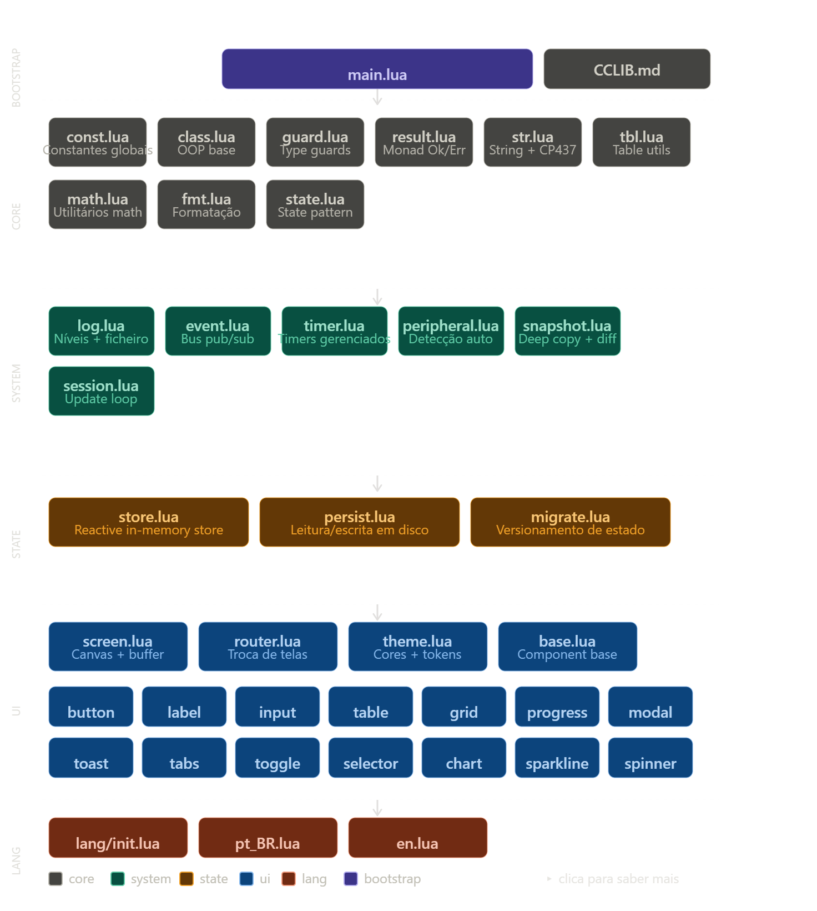

# CCLib — Referência de Arquitetura
> Última atualização: 1.0.0

Este ficheiro é a **fonte única de verdade** para a arquitetura do CCLib.
Toda convenção, regra de dependência e decisão de design está aqui documentada.



---

## Estrutura de pastas

```
cclib/
├── main.lua                  ← Bootstrap / entry point do projeto
├── CCLIB.md                  ← Este ficheiro
│
├── core/                     ← Utilitários puros. Sem side-effects. Sem periféricos.
│   ├── const.lua             ← Constantes globais (versão, cores, keys, sides)
│   ├── class.lua             ← Sistema OOP base (herança, instâncias)
│   ├── guard.lua             ← Type guards e validação de argumentos
│   ├── result.lua            ← Monad Ok/Err para tratamento de erros
│   ├── str.lua               ← String utils + encode CP437 + chars especiais
│   ├── tbl.lua               ← Table utils (map, filter, reduce, deepCopy…)
│   ├── math.lua              ← Math utils (clamp, lerp, percent, round…)
│   └── fmt.lua               ← Formatação (números, bytes, tempo, duração)
│
├── system/                   ← Infra do runtime. Pode usar core/. Pode usar CC globals.
│   ├── log.lua               ← Sistema de logging (níveis, ficheiro, monitor de debug)
│   ├── event.lua             ← Event bus pub/sub sobre os eventos nativos CC
│   ├── timer.lua             ← Gestão de timers nomeados com callbacks
│   ├── peripheral.lua        ← Detecção automática de periféricos + eventos
│   ├── snapshot.lua          ← Deep copy + diff de tabelas (para undo/reatividade)
│   └── session.lua           ← Update loop principal (um por aplicação)
│
├── state/                    ← Gestão de estado. Usa core/ e system/.
│   ├── store.lua             ← Reactive in-memory store com watchers
│   ├── persist.lua           ← Serialização/leitura em disco com debounce
│   └── migrate.lua           ← Migração de dados entre versões de schema
│
├── ui/                       ← Camada visual. Usa todas as camadas abaixo.
│   ├── screen.lua            ← Canvas com double-buffer (elimina flickering)
│   ├── router.lua            ← Stack de telas com push/pop/replace + params
│   ├── theme.lua             ← Tokens de cor semânticos para CC (16 cores)
│   └── components/
│       ├── base.lua          ← Ciclo de vida base de todos os componentes
│       ├── button.lua
│       ├── label.lua
│       ├── input.lua
│       ├── table.lua
│       ├── grid.lua
│       ├── progress.lua
│       ├── spinner.lua
│       ├── toggle.lua
│       ├── modal.lua
│       ├── toast.lua
│       ├── tabs.lua
│       ├── selector.lua
│       ├── chart.lua
│       └── sparkline.lua
│
└── lang/                     ← Internacionalização. Sem dependências.
    ├── init.lua              ← Motor i18n (load, get, set, merge)
    ├── en.lua
    └── pt_BR.lua
```

---

## Regras de dependência (RÍGIDAS)

```
lang  →  (ninguém)
core  →  (ninguém)
system → core
state  → core, system
ui     → core, system, state, lang
```

- Uma camada **só pode importar** da camada abaixo ou da mesma camada.
- `core/` **nunca** importa nada do projeto — é Lua puro.
- Se precisares de uma dependência que viola esta regra, o módulo está na camada errada.

---

## Como usar o require

Todos os módulos usam `require` relativo à raiz do projeto.
A raiz do projeto deve estar no PATH do CC (`package.path`).

```lua
-- No main.lua, configurar o path uma vez:
package.path = package.path .. ";/cclib/?.lua"

-- Em qualquer módulo:
local Const = require("core.const")
local Tbl   = require("core.tbl")
local Log   = require("system.log")
```

**Nunca usar caminhos absolutos** (`/cclib/core/const`) dentro dos módulos da lib.
Isso permite que o utilizador coloque a lib em qualquer pasta.

---

## Convenções de código

### Nomes de módulos
- Módulos exportam **uma única tabela** com nome igual ao ficheiro, em PascalCase.
- Exemplo: `core/str.lua` → `local Str = {} ... return Str`

### Funções
- Funções públicas: `Modulo.funcao(args)`
- Métodos de instância: `instancia:metodo(args)` (usa `self`)
- Funções internas (privadas): `local function _nomeInterno()`

### Erros
- Módulos `core/` podem usar `error()` diretamente.
- Módulos `system/` e acima devem retornar `Result.err()` em vez de `error()`.
- Nunca usar `assert()` em código de produção — prefere `guard` ou `result`.

### Comentários de módulo
Cada ficheiro começa com:
```lua
-- cclib / core / nome.lua
-- Descrição curta do que este módulo faz.
-- Dependências: lista de requires
```

---

## Ciclo de vida de uma aplicação CCLib

```
main.lua
  ├── Configura package.path
  ├── Carrega Const (DEV mode, etc.)
  ├── Inicia Log
  ├── Inicia Peripheral (detecção automática)
  ├── Cria Screen (com o monitor detetado)
  ├── Regista rotas (Router.register)
  ├── Carrega estado inicial (Store + Persist)
  └── Session.run(...)   ← ÚNICO update loop da aplicação
          ├── onStart  → Router.push("home")
          ├── onUpdate → Event bus distribui evento → Router → Tela ativa → Componentes
          └── onStop   → Persist.saveAll()
```

---

## Sistema de telas (Router)

Cada tela é um módulo que retorna uma tabela com este formato:

```lua
-- screens/home.lua
local Home = {}

function Home.onMount(params)
  -- chamado ao entrar na tela
  -- params = tabela passada no Router.push("home", params)
end

function Home.onUnmount()
  -- chamado ao sair da tela
end

function Home.onUpdate(event, ...)
  -- chamado em cada ciclo do event loop com o evento CC
end

function Home.render(screen)
  -- chamado quando a tela precisa de redesenhar
  -- screen é o objeto Screen (double-buffer)
end

return Home
```

---

## Sistema de estado (Store)

```lua
local store = Store.create({
  contador = 0,
  items    = {},
})

store:get("contador")                    --> 0
store:set("contador", 5)                 --> dispara watchers
store:patch({ contador = 10 })           --> update atómico
store:watch("contador", function(new, old) end)
store:snapshot()                         --> deep copy do estado atual
```

---

## Logging

```lua
-- Níveis: DEBUG=1, INFO=2, WARN=3, ERROR=4, FATAL=5
Log.debug("modulo", "mensagem %s", valor)
Log.info("session", "Update loop iniciado")
Log.warn("peripheral", "Monitor não encontrado no side %s", side)
Log.error("store", "Falha ao salvar: %s", err)
Log.fatal("session", "Crash irrecuperável")
```

Output: `[12:04:33] [ERROR] [peripheral] Monitor não encontrado no side top`

---

## DEV mode

Ativa em `core/const.lua`:
```lua
Const.DEV = true
```

Com DEV ativo:
- Logs verbosos (nível DEBUG visível)
- Bordas visíveis em todos os componentes
- Nome da tela atual no canto superior direito do monitor
- Overlay de ciclos/segundo do update loop
- Tela especial `cclib:inspector` (Ctrl+D) com store, router stack e timers ativos
